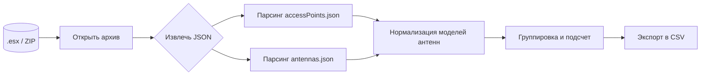

# 🧰 EkahauBOM

**EkahauBOM** — утилита на Python для генерации **Bill of Materials (BOM)** из проекта Ekahau (файл `.esx`).
Скрипт извлекает точки доступа и антенны, группирует по моделям и сохраняет результат в CSV. Минимум магии, максимум пользы.

---

## 📋 Содержание

* [Функции](#-функции)
* [Архитектура](#-архитектура)
* [Установка](#-установка)
* [Быстрый старт](#-быстрый-старт)
* [Использование](#-использование)
* [Вывод и структура файлов](#-вывод-и-структура-файлов)
* [Требования и зависимости](#-требования-и-зависимости)
* [Ограничения и примечания](#-ограничения-и-примечания)
* [Contributing](#-contributing)
* [Лицензия](#-лицензия)
* [Roadmap](#-roadmap)

---

## ✨ Функции

* Чтение `.esx` (ZIP-архив с JSON внутри)
* Парсинг списка **точек доступа** и **антенн**
* Нормализация имен моделей (для корректной группировки)
* Подсчет количества каждой модели
* Экспорт в CSV: `access_points.csv` и `antennas.csv`

---

## 🏗 Архитектура



---

## 🛠 Установка

```bash
git clone https://github.com/htechno/EkahauBOM.git
cd EkahauBOM
python3 -m venv venv
# Linux / macOS
source venv/bin/activate
# Windows (PowerShell)
# .\venv\Scripts\Activate.ps1

pip install -r requirements.txt
```

> Если внешний зависимостей нет, `requirements.txt` может быть пустым (или отсутствовать).

---

## ⚡ Быстрый старт

```bash
python EkahauBOM.py path/to/design.esx
```

Результат появится в той же директории: два CSV-файла с суммарным списком моделей AP и антенн.

---

## ▶️ Использование

```bash
python EkahauBOM.py /path/to/your_project.esx
```

Пример вывода в консоли:

```
Generating BOM from myDesign.esx
--------------------------------------------------
12x Cisco C9120I
3x Cisco C9130E + AIR-ANT2524DW-R
```

> Формат имен зависит от данных в `.esx`. Встроенные антенны могут быть указаны в имени AP.

---

## 📂 Вывод и структура файлов

```
EkahauBOM/
├── EkahauBOM.py
├── requirements.txt        # может быть пустым, если нет внешних пакетов
├── LICENSE
└── README.md
```

После запуска в рабочей директории создаются файлы:

* `access_points.csv` — модели точек доступа и их количество
* `antennas.csv` — модели антенн и их количество

---

## 🔧 Требования и зависимости

* Python **3.7+**
* Стандартная библиотека Python (например, `zipfile`, `json`, `argparse`) обычно достаточна
* Если в код добавлены сторонние пакеты, перечислите их в `requirements.txt` вида:

  ```
  pandas>=2.0
  tabulate>=0.9
  ```

  и выполните `pip install -r requirements.txt`

---

## ⚠️ Ограничения и примечания

* `.esx` — это ZIP с JSON-структурами; если Ekahau изменит внутренний формат, может потребоваться доработка парсинга
* Нормализация имен моделей минималистична: при «экзотическом» нейминге возможны дубликаты строк, отличающиеся написанием
* CSV экспорт не содержит цен; это именно **BOM по моделям**, не коммерческая спецификация

---

## 🤝 Contributing

1. Форкните репозиторий
2. Создайте ветку `feature/<краткое-имя>`
3. Покройте изменения простыми тестовыми кейсами/примерами
4. Оформите pull request с понятным описанием

Рекомендации к стилю коммитов:

* `feat:` новая функциональность
* `fix:` исправление бага
* `docs:` документация
* `refactor:` без изменения поведения

---

## 📄 Лицензия

Проект распространяется под лицензией **MIT**. См. файл `LICENSE`.

---

## 🛣 Roadmap

* Опциональный экспорт в XLSX
* Проверка совместимости версии `.esx` и предупреждения
* Мини-GUI (drag-and-drop файла и предпросмотр результата)
